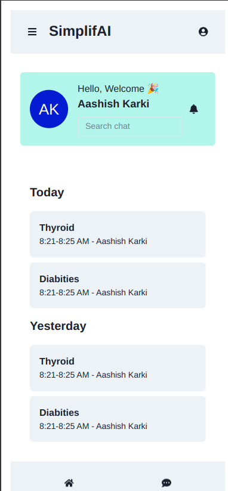
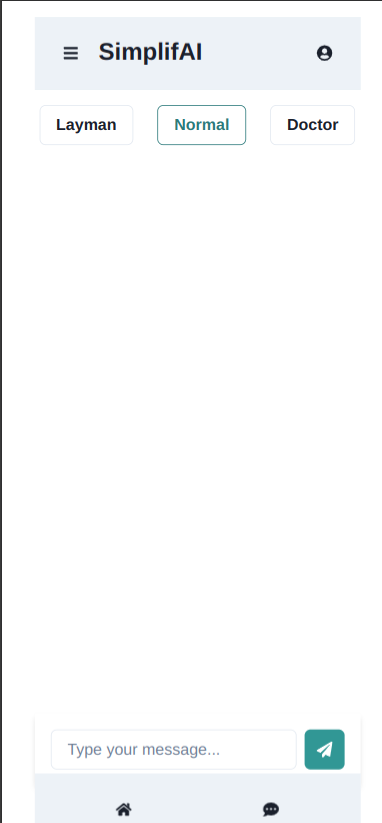
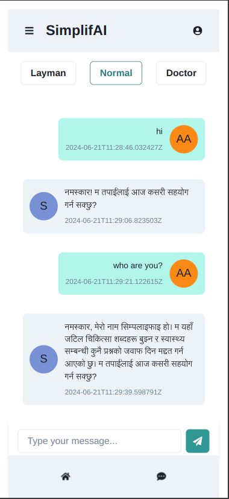

# SimplifAI

This is our health assistant who was developed to reduce the gap between you and complex medical terminology.

Upload report photo, and get summary of it.

Chat with both querying your doubts. 


## Screenshots
### Login and Home


### Modes and Chat


### In Nepali



## Original Creator

- [BioMistral](https://huggingface.co/BioMistral)
- [paper]( https://arxiv.org/abs/2402.10373)

### Requirement

   - 8GB RAM
   - Strong CPU
## Demo,Instructions And Slides

- [Slides](https://drive.google.com/file/d/1FcLwucSfjVWpzxPDvSBgjqnv9nEvJqhi/view?usp=sharing)
- [Instruction](https://drive.google.com/file/d/1ky-g7-DsTIYZH7xomxCEcHgeHvzBID0B/view?usp=sharing)
- [Demo](https://drive.google.com/file/d/1tjwzc149nA4Bt4MDQ6evVmCv5K6UApwY/view?usp=sharing)
## Prerequisites:
This is using Ollama as the inference engine, and it's running the anoob/simp2 quantized version

Install ollama:

Option 1:
```
curl -fsSL https://ollama.com/install.sh | sh
```
Option 2:

download ollama from 
https://ollama.com/download


After installation, to pull the required model using Ollama, use the command below:
```
ollama run anoob/simp2
```

Test if the model is correctly installed and running by sending a request:
```
curl http://localhost:11434/api/generate -d '{
  "model": "anoob/simp2",
  "prompt":"Who are you?"
}'
```

If you wish to chat in Nepali
```
# Make sure you have git-lfs installed (https://git-lfs.com)
git lfs install

# update the path for translator in backend/simplifai/reports/to_nepali.py file to the directory where you clone this 
git clone https://huggingface.co/rujengelal/my_awesome_english_to_nepali_tst

pip install transformers
pip install torch torchvision torchaudio

```

Set up a virtual environment and activate it:
```
python3 -m venv .env
source .env/bin/activate
```

Install all the necessary Python packages from the requirements file:
```
pip3 install -r requirements.txt
```
Then import following libraries

```
pip3 install Django==5.0.6
pip3 install djangorestframework==3.15.2
pip3 install django-cors-headers
python3 -m pip install paddlepaddle -i https://mirror.baidu.com/pypi/simple
pip3 install langchain_community
pip3 install paddleocr

```


### Run Backend

navigate to backend\simplifai

```
python3 manage.py runserver
```


### Run Frontend in Dev Mode.

navigate to SimplifAI\frontend

```
   npm install
   npm run dev
```

### Build PWA for your Mobile Devices
```
npm run build
npx serve dist
```
-Hit the Local Network IP as indicated on the Terminal<br>
-Save the PWA.<br>

### Note
login as guest
